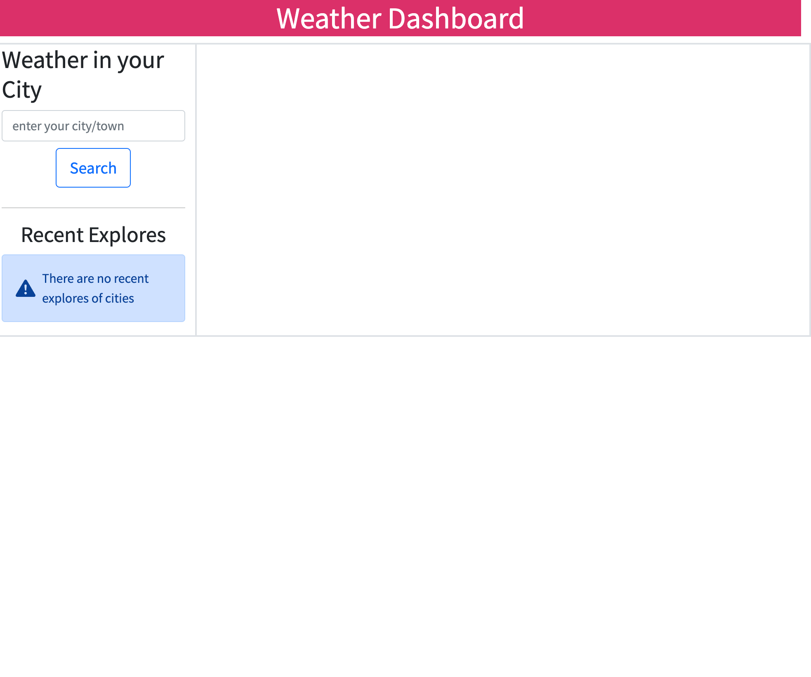
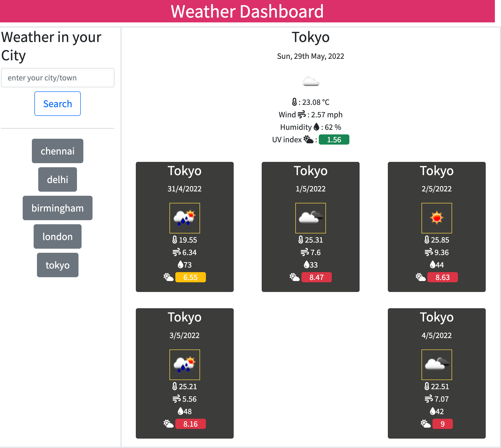

# dashboard-with-weather 🌩️

An application that works using JQuery, HTML and CSS to generate a weather forecast for cities around the world.

## Deployed URL

Click the link [here](https://amirtha-coder.github.io/dashboard-with-weather/) to access the webpage.

## User Journey

```
GIVEN a weather dashboard with form inputs
WHEN I search for a city
THEN I am presented with current and future conditions for that city and that city is added to the search history
WHEN I view current weather conditions for that city
THEN I am presented with the city name, the date, an icon representation of weather conditions, the temperature, the humidity, the wind speed, and the UV index
WHEN I view the UV index
THEN I am presented with a color that indicates whether the conditions are favorable, moderate, or severe
WHEN I view future weather conditions for that city
THEN I am presented with a 5-day forecast that displays the date, an icon representation of weather conditions, the temperature, the wind speed, and the humidity
WHEN I click on a city in the search history
THEN I am again presented with current and future conditions for that city

```

## Screenshots

### 

### 

## Technologies

- HTML
- CSS
- Coolers
- Javascript
- JQuery
- Git

## Previous projects

- #### Project 1: semantic HTML and adding CSS to refactor the webpage for a marketing agency. Click the link [here](https://winner-am1.github.io/semantic_html_refactor/) to access the webpage.
- #### Project 2: My professional portfolio created using HTML and CSS.Click the link [here](https://amirtha-coder.github.io/amirtha-portfolio/) to access the webpage.
- #### Project 3: My random password generator created via javascript. Click the link [here](https://amirtha-coder.github.io/random-password-generator/) to access the webpage.
- #### Project 4: To create this timed code quiz I had to used HTML, CSS, Javascript and Web APIs. Click the link [here](https://amirtha-coder.github.io/timed-code-quiz/) to access the webpage
- #### Project 5: To create this work day planner using HTML, CSS and JQuery .Click the link [here](https://amirtha-coder.github.io/work-day-planner/) to access the webpage.
- ..._PENDING_...
